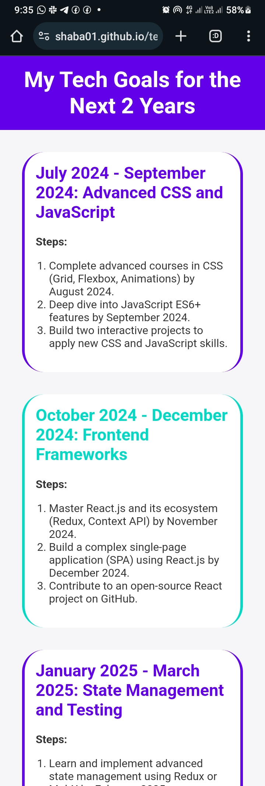
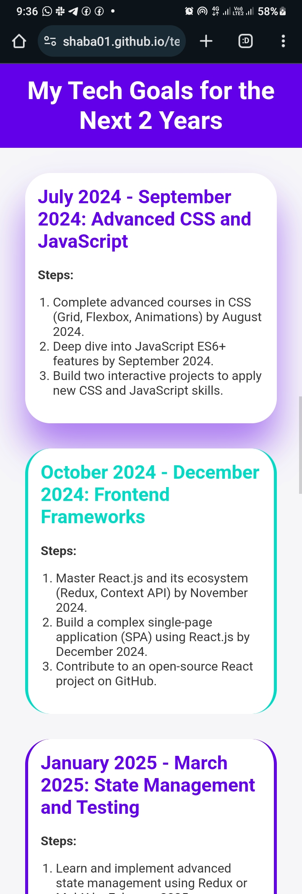
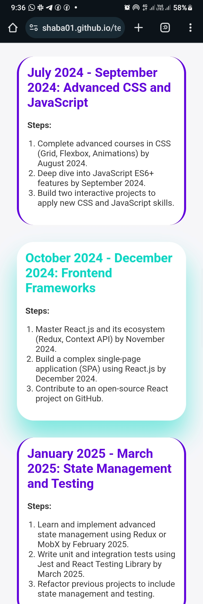

# My Tech Goals for the Next 2 Years

This is a single-page website outlining my goals for the next 2 years in the tech field. The website is built using HTML and CSS only, ensuring it is visually appealing, mobile-friendly, and responsive. Each section includes specific dates and detailed steps for achieving each goal, presented in a timeline format with smooth CSS animations.

## Table of contents

- [Overview](#overview)
  - [Task](#task)
  - [Screenshot](#screenshot)
  - [Links](#links)
- [My process](#my-process)
  - [Built with](#built-with)
  - [Features](#features)
  - [Structure](#structure)
  - [Sections](#sections)
- [Author](#author)

## Overview

### Task

Create and host a single-page website outlining your goals for the next 2 years in the tech field.
The website should be visually appealing, mobile-friendly, and utilize html and css only.
Each required element should have a specified data-testid attribute for easy identification and testing.

**Requirements:**

- **Language:** Html and Css only. No Javascript allowed.
- **Responsiveness:** The website must be responsive and function well on all devices (desktop, tablet, mobile).

### Screenshot

                                                      Desktop view

                                                      Mobile view

### Links

- [Solution URL](https://github.com/SHABA01/tech-goals)
- [Live Site URL](https://shaba01.github.io/tech-goals)

## My process

### Built with

- HTML5
- CSS3

### Features

- **Timeline Format:** Goals are organized into a 3-month grouping format (excluding the last).
- **Responsive Design:** The website is designed to function well on all devices, including desktops, tablets, and mobile phones.
- **CSS Animations:** Smooth transitions and animations (hover effect) enhance the user experience.
- **Data Test IDs:** Each required element has a specified `data-testid` attribute for easy identification and testing.

### Structure

- **Header:** Contains the main title of the website.
- **Main Content:** Divided into sections, each representing a goal with specific steps and timelines.
- **Footer:** Contains the copyright information.

### Sections

1. **Q3 2024 - Master Web Development**

   - Complete advanced courses in HTML, CSS, JavaScript by December 2024.
   - Build and deploy three full-stack applications using React and Node.js by March 2025.
   - Participate in coding challenges and hackathons monthly to enhance problem-solving skills.

2. **Q1 2025 - Contribute to Open Source**

   - Identify and select five open-source projects on GitHub by January 2025.
   - Make regular contributions and submit pull requests by March 2025.
   - Collaborate with project maintainers to fix bugs and add new features.

3. **Q3 2025 - Develop Soft Skills**

   - Attend monthly workshops on communication and teamwork starting July 2025.
   - Engage in team projects and take on leadership roles by October 2025.
   - Read books on effective communication and leadership.

4. **Q1 2026 - Gain Certifications**

   - Enroll in cloud computing, cybersecurity, and data science courses by January 2026.
   - Complete all certification exams by June 2026.
   - Apply learned skills in personal and professional projects.

5. **Q4 2026 - Build a Personal Project Portfolio**

   - Create and document at least five projects by September 2026.
   - Develop a personal website to showcase projects by October 2026.
   - Share portfolio with potential employers and the tech community.

## Author

- LinkedIn - [Philip Shaba](https://www.linkedin.com/in/philip-shaba-0879a5150)